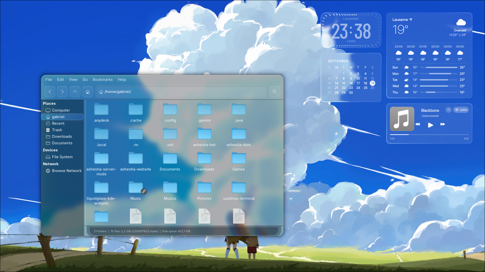

# Ashestia Hyprland Rice

> Minimalist, modern, zero-latency gaming and daily productivity setup for Linux (CachyOS / Arch Linux).

---

## Preview



---

## Hardware & System Specifications

* **Operating System:** CachyOS (Kernel BORE / linux-cachyos)
* **Hardware:** ASUS TUF Gaming FA607NUG
* **Processor:** AMD Ryzen 7 7445HS
* **Graphics:** NVIDIA GeForce RTX 4050 Laptop (140W TGP)
* **Compositor:** Hyprland 0.47+ (Configured in Lua via `hyprland.lua`)
* **Bar & Desktop Widgets:** QuickShell Desktop Widgets (Clock, Calendar, Weather, Music with Synced Lyrics & LiquidGlass)
* **Terminal:** foot / footclient (Instant startup via systemd daemon, alpha 0.80)
* **Color Palette:** Matugen (Dynamic color generation synchronized with wallpaper)
* **Terminal Fetch:** Fastfetch with Sixel graphics and automatic picture rotation
* **Audio Visualizer:** Cava
* **Notifications:** Mako

---

## Foot Terminal & Fastfetch Sixel

The terminal setup includes:
* **Smooth Transparency:** `alpha=0.80` with `JetBrainsMono Nerd Font`.
* **Dynamic Palette:** Colors generated and synchronized in real time via Matugen based on the active wallpaper.
* **Fish Greeting & Fastfetch:** Automatic circular rotation of pictures from `~/Pictures/Goticas` rendered in high resolution directly in the terminal using Sixel graphics.

---

## Installation

Clone the repository, navigate into the directory, and run the installation script:

```bash
git clone https://github.com/gabesvr/ashestia-dots.git
cd ashestia-dots
chmod +x install.sh
./install.sh
```

---

## Keybindings

| Shortcut | Action |
| :--- | :--- |
| `Super + Enter` | Open Terminal (`footclient`) |
| `Super + B` | Open Browser (`Firefox`) |
| `Super + E` | Open File Manager (`Thunar`) |
| `Super + Space` | Toggle Control Center / Island Menu |
| `Super + Shift + S` | Region Screenshot |
| `Print` | Fullscreen Screenshot |
| `Super + Q` | Close Active Window |
| `Super + F` | Toggle Floating Window |
| `Super + [1-9]` | Switch to Workspace |

---

## Monitor Configuration

By default, `hyprland.lua` is set to auto-detect any monitor and native resolution (`preferred, auto, 1`). To configure a fixed refresh rate (such as 144Hz or 180Hz) or multi-monitor setup, edit the `MONITORS` section in `~/.config/hypr/hyprland.lua`.

---

Created by Gabriel • Ashestia Community
