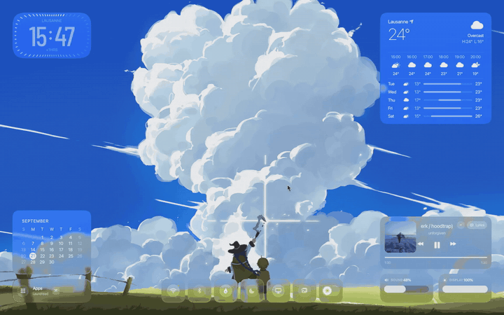
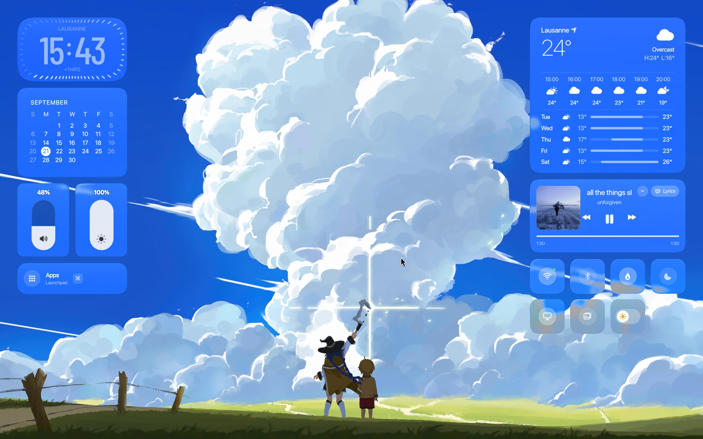
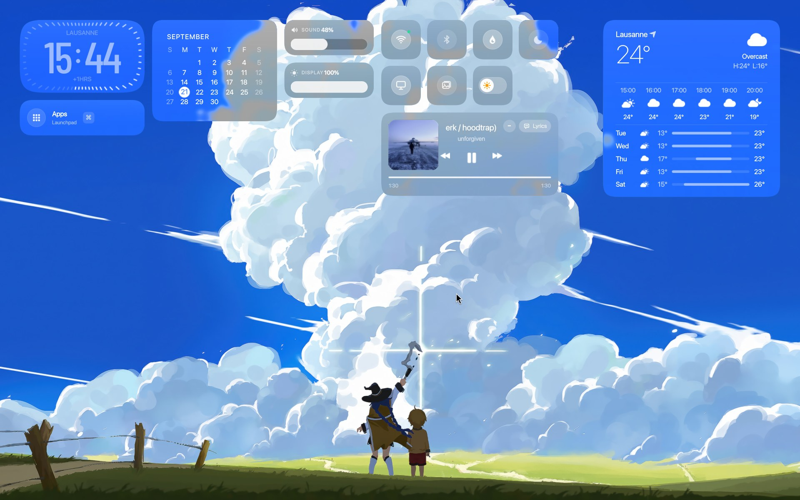
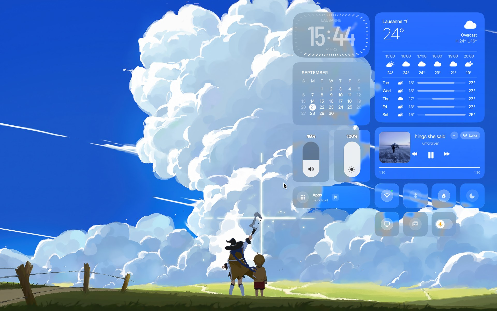
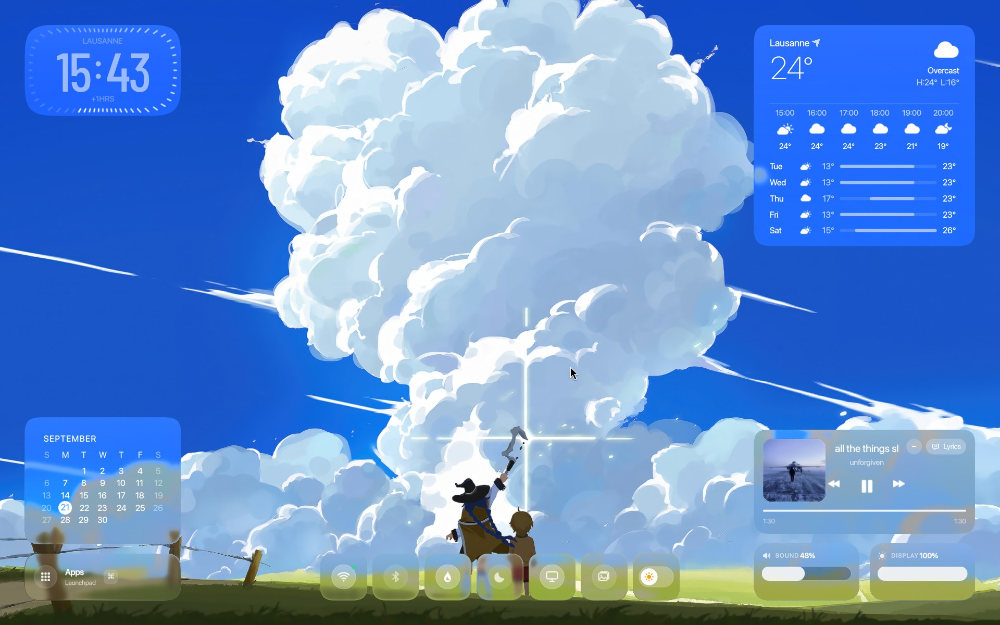
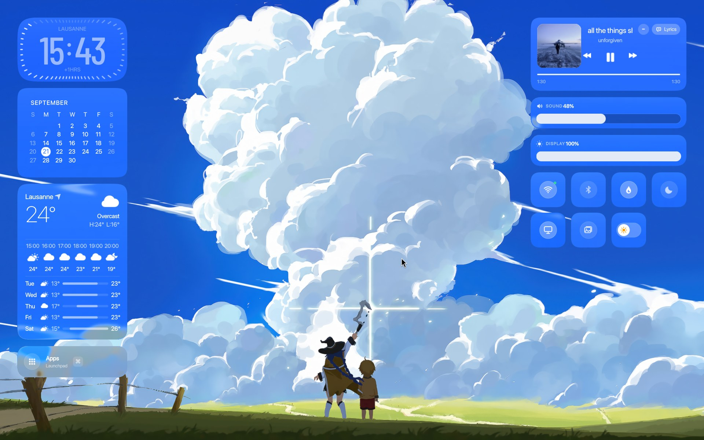
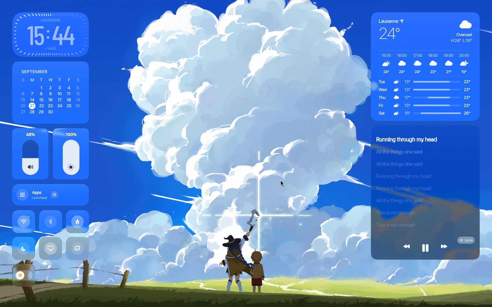
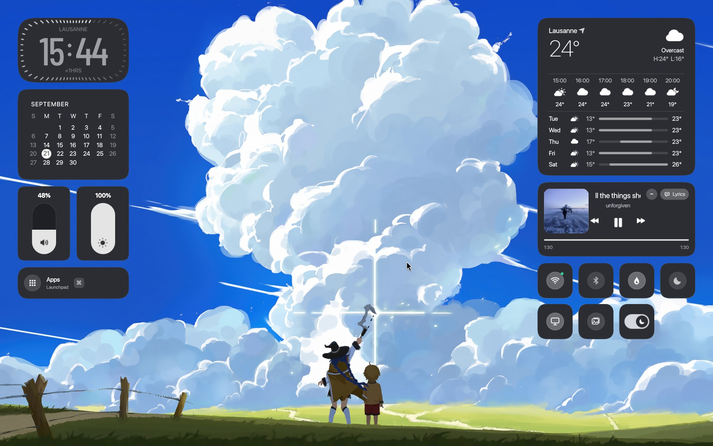
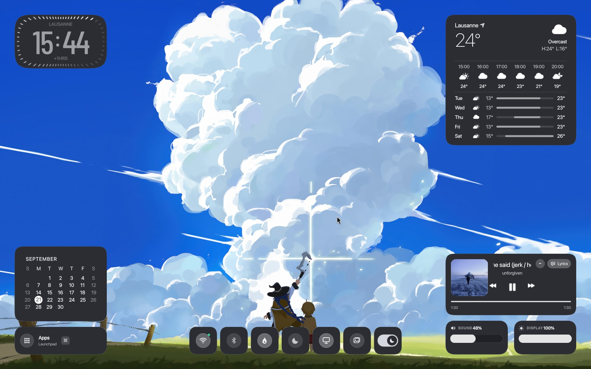

# Ashestia Hyprland Rice

> Minimalist, modern, zero-latency gaming and daily productivity setup for Linux (CachyOS / Arch Linux), with macOS-style **Liquid Glass** desktop widgets built in QuickShell.


<p align="center">
  
</p>

> Full quality video: [`assets/demo/ashestia-demo.mp4`](assets/demo/ashestia-demo.mp4) (layout switching, solid-mode key, expanding panels, synced lyrics).

---

## Highlights

* **Liquid Glass widgets** rendered by a custom GLSL shader: soft frosted blur, a thin lens refraction near the edges, extra vibrancy and adaptive darkening so white text stays readable over bright wallpapers.
* **5 adaptive layouts** that recompute from the real screen size (no overlapping, works with fractional scaling) and switch with a staggered "wave" animation.
* **Spring animations** everywhere: widgets move with a slight overshoot, panels grow and settle like on macOS. Hyprland windows, workspaces and layers use spring curves too.
* **Solid mode key**: an animated macOS-style switch tile turns every widget from glass into a flat dark gray surface (`#2b2d33`, same color as the terminal). The change ripples out from the switch.
* **Expandable panels** for Wi-Fi, Bluetooth and Wallpapers with clean SF-style iconography, signal bars, iOS-style switches and inline password entry.
* **Synced lyrics** panel for the music widget that resizes itself so it never covers the weather widget.
* Everything is driven by a tiny FIFO interface, so Hyprland binds (or scripts) can control the shell.

---

## Layouts

| | |
| :---: | :---: |
| <br>**1. Sonoma Flanks** | <br>**2. Top Shelf** |
| <br>**3. Smart Sidebar** | <br>**4. Four Corners** |
| <br>**5. Creative Studio** | <br>**Synced lyrics panel** |

### Solid mode (the key tile)

| | |
| :---: | :---: |
|  |  |

---

## Hardware & System Specifications

* **Operating System:** CachyOS (Kernel BORE / linux-cachyos)
* **Hardware:** ASUS TUF Gaming FA607NUG (16" 1920x1200 @144Hz, fractional scale 1.25)
* **Processor:** AMD Ryzen 7 7445HS
* **Graphics:** NVIDIA GeForce RTX 4050 Laptop (140W TGP)
* **Compositor:** Hyprland 0.56+ (configured in Lua via `hyprland.lua`)
* **Desktop Widgets:** QuickShell (Clock, Calendar, Quick Controls, Weather, Music with Synced Lyrics, Liquid Glass shaders)
* **Terminal:** foot / footclient (instant startup via systemd daemon, flat `#2b2d33` background)
* **Color Palette:** Matugen (dynamic colors generated from the wallpaper)
* **Terminal Fetch:** minimal Fastfetch with the Claude mascot
* **Audio Visualizer:** Cava
* **Notifications:** Mako

---

## Desktop Widgets

* **Clock Widget:** digital clock with localized timezone offset and tick ring.
* **Calendar Widget:** full-month calendar with active day highlight.
* **Quick Controls & Sliders:** volume and brightness sliders plus tiles: Wi-Fi, Bluetooth, App drawer, Turbo mode, Do Not Disturb, Xwayland toggle, Wallpaper picker and the **solid-mode switch**.
* **Weather Widget:** live weather from Open-Meteo (current conditions, hourly forecast, 5-day outlook).
* **Music Widget:** real-time player with sub-second Spotify sync, album art and an interactive synced lyrics view.

### Controlling the shell (FIFO)

```bash
echo layout:4   > /tmp/qs-island-fifo   # switch layout (1-5 or "next")
echo theme      > /tmp/qs-island-fifo   # toggle solid mode
echo wifi       > /tmp/qs-island-fifo   # open/close the Wi-Fi panel
echo bt         > /tmp/qs-island-fifo   # open/close the Bluetooth panel
echo lyrics     > /tmp/qs-island-fifo   # open/close the lyrics panel
echo wallpaper:panel > /tmp/qs-island-fifo   # open/close the wallpaper gallery
```

---

## Terminal & Fastfetch

* Flat dark gray `#2b2d33` background with a soft blue/orange palette, block cursor, `DejaVu Sans Mono` with `JetBrainsMono Nerd Font` as icon fallback.
* Fish greeting runs a minimal `fastfetch` (user, OS, WM, shell, memory) next to the Claude mascot.

---

## Installation

Requirements: `hyprland`, `quickshell`, `foot`, `fish`, `matugen`, `mako`, `cava`, `qt6-shadertools` (for `qsb`), `gcc` (helper daemons).

```bash
git clone https://github.com/gabesvr/ashestia-dots.git
cd ashestia-dots
chmod +x install.sh
./install.sh
```

If you edit a shader (`launcher/widgets/shaders/*.frag`), recompile and **restart** QuickShell (Qt caches shaders per process):

```bash
/usr/lib/qt6/bin/qsb --glsl "300 es,330" --hlsl 50 --msl 12 -o X.frag.qsb X.frag
systemctl --user restart quickshell
```

---

## Keybindings

| Shortcut | Action |
| :--- | :--- |
| `Super + Enter` | Open Terminal (`foot`) |
| `Super + T` | Floating Terminal |
| `Super + W` | Open Browser (`Firefox`) |
| `Super + E` | Open File Manager (`Thunar`) |
| `Super + A` / `Super + Space` | App Launchpad |
| `Super + I` | Control Center Island |
| `Super + G` | Next widget layout |
| `Super + Alt + [1-5]` | Jump to widget layout |
| `Super + Shift + S` | Region Screenshot |
| `Print` | Fullscreen Screenshot |
| `Super + Q` | Close Active Window |
| `Super + F` | Toggle Floating Window |
| `Super + [1-9]` | Switch to Workspace |

---

## Monitor Configuration

`hyprland.lua` is tuned for a 1920x1200 @144Hz laptop panel with `scale = 1.25`. Edit the `MONITORS` section in `~/.config/hypr/hyprland.lua` for a different refresh rate, resolution or a multi-monitor setup. The widget layouts are computed from the real screen size, so they adapt automatically to other scales.

---

Created by Gabriel • Ashestia Community
